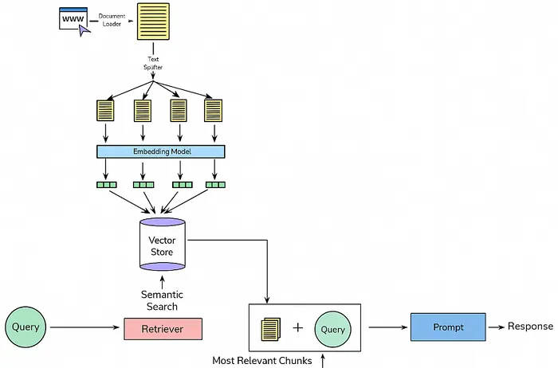

# 📄 Multi-Document Conversational Question Answering System (RAG)

A production-ready **AI-powered document intelligence system** that allows users to upload **multiple PDF documents** and ask **natural language questions** about their content using **Retrieval-Augmented Generation (RAG)**.

The system retrieves relevant document sections using **semantic similarity search** and generates **accurate, grounded answers** with **transparent source attribution (PDF + page number)**.

---

## Deployment Link
https://rag-ai-project-p2vrnkxfydrt4vcwkfpnar.streamlit.app/

---

## 🔥 Key Highlights

- 📂 Upload and query **multiple PDFs**
- 🔍 **Semantic retrieval** using embeddings + FAISS
- 🧠 **Retrieval-Augmented Generation (RAG)**
- ⚡ Fast inference using **LLaMA 3.1-8B Instant (Groq)**
- 🧾 **Source attribution** for every answer
- 🔒 Secure API key handling via environment variables
- 🧱 Modular & scalable architecture
- 🎯 Interview-ready, resume-ready project

---

## 🧠 What is RAG?

**Retrieval-Augmented Generation (RAG)** combines:
1. **Information Retrieval** → fetch relevant document chunks  
2. **Text Generation** → generate answers strictly from retrieved content  

This prevents hallucinations and ensures answers are **grounded in real documents**.

---

## 🏗️ System Architecture



---

## 🛠️ Tech Stack

### 🔹 Core Technologies
- **Python**
- **Streamlit** – User Interface
- **FAISS** – Vector similarity search
- **Sentence-Transformers** – Text embeddings
- **Groq API** – LLaMA 3.1-8B Instant (LLM)

### 🔹 Supporting Tools
- **uv** – Dependency & environment management
- **python-dotenv** – Environment variables
- **PyPDF** – PDF parsing

---

## 📁 Project Structure

```text
multi-doc-rag/
│
├── app/
│   ├── main.py
│   │   # Streamlit entry point
│   │   # Orchestrates all phases:
│   │   # Upload → Ingestion → Chunking → Embedding → FAISS → RAG Answer
│   │
│   ├── ui/
│   │   ├── __init__.py
│   │   └── interface.py
│   │       # File upload UI
│   │       # Question input UI
│   │
│   ├── ingestion/
│   │   ├── __init__.py
│   │   ├── pdf_loader.py
│   │   │   # Loads PDF from disk
│   │   ├── parser.py
│   │   │   # Extracts text page-by-page
│   │   └── metadata.py
│   │       # Attaches session_id, PDF name, page number
│   │
│   ├── preprocessing/
│   │   ├── __init__.py
│   │   ├── cleaner.py
│   │   │   # Cleans raw extracted text
│   │   └── chunker.py
│   │       # Splits text into overlapping chunks
│   │
│   ├── embeddings/
│   │   ├── __init__.py
│   │   └── embedder.py
│   │       # Generates embeddings using Sentence Transformers
│   │
│   ├── vectorstore/
│   │   ├── __init__.py
│   │   ├── faiss_store.py
│   │   │   # FAISS index creation & search
│   │   └── retriever.py
│   │       # Semantic retrieval logic
│   │
│   ├── llm/
│   │   ├── __init__.py
│   │   ├── prompt.py
│   │   │   # Strict RAG prompt construction
│   │   └── generator.py
│   │       # Groq LLaMA 3.1-8B Instant answer generation
│   │
│   └── config/
│       ├── __init__.py
│       ├── settings.py
│       │   # Model names, parameters, constants
│       └── env.py
│           # Loads & validates GROQ_API_KEY
│
├── data/
│   └── uploads/
│       ├── <session-id-1>/
│       │   └── document1.pdf
│       └── <session-id-2>/
│           └── document2.pdf
│
├── images/
│   └── architecture.png
│
├── .env
│   # GROQ_API_KEY (ignored by git)
│
├── .gitignore
├── requirements.txt
├── README.md
└── uv.lock   (optional)


